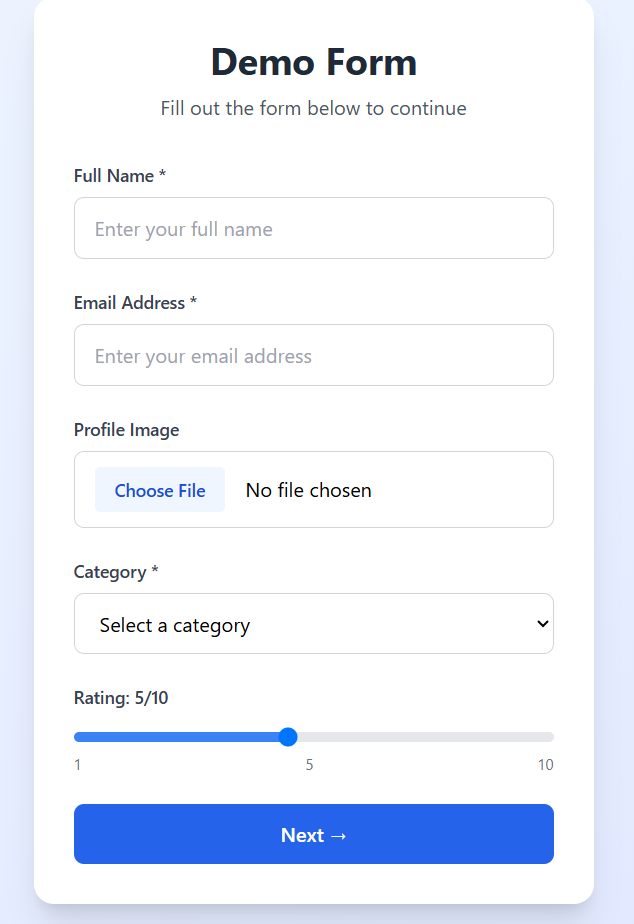
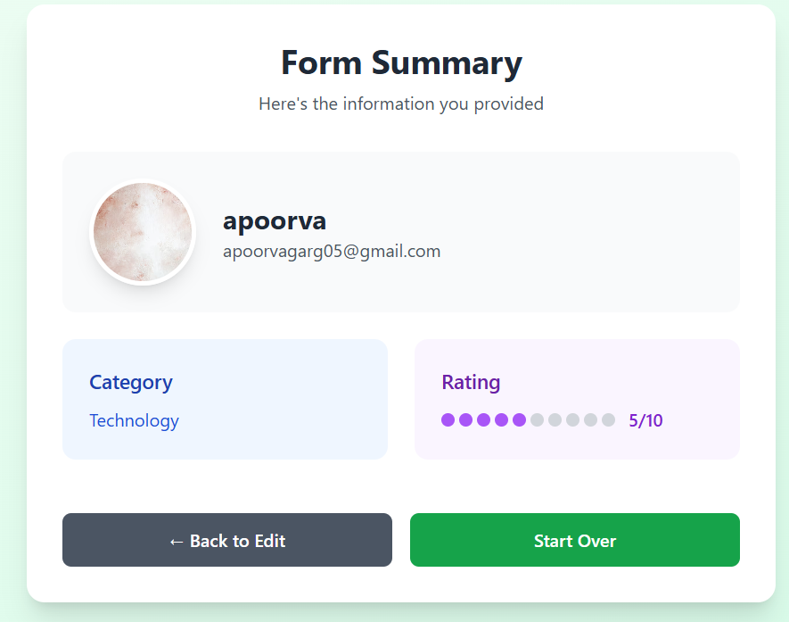

# React Form Demo

A modern two-page form application built with React and Tailwind CSS, featuring form validation, file uploads, and clean data presentation.

## Features

- **Interactive Form**: Name, email, image upload, dropdown, and rating slider
- **Form Validation**: Real-time validation for required fields and email format
- **Image Preview**: Instant preview of uploaded images
- **Data Display**: Clean summary page with profile section and organized cards
- **Responsive Design**: Works on desktop and mobile devices

## Screenshots

### Form Page


### Summary Page


## Getting Started

### Installation

```bash
# Clone the project
git clone <https://github.com/apoorva00100/baisc-react-app/tree/main/react-form-demo>
cd react-form-demo

# Install dependencies
npm install

# Start development server
npm start
```

### Troubleshooting
If you encounter OpenSSL errors with newer Node.js versions:
```bash
set NODE_OPTIONS=--openssl-legacy-provider && npm start
```

## Form Fields

| Field | Type | Required | Description |
|-------|------|----------|-------------|
| Name | Text | Yes | User's full name |
| Email | Email | Yes | Valid email address |
| Image | File | No | Profile image upload |
| Category | Dropdown | Yes | Select from 5 categories |
| Rating | Slider | No | 1-10 rating scale |

## Technical Details

- **Validation**: Required fields and email format checking
- **File Handling**: Image upload with FileReader API preview
- **State Management**: React hooks for form data and validation
- **Styling**: Tailwind CSS with gradients and animations
- **Navigation**: Two-page flow with back/reset functionality

## Customization

### Adding Fields
Update the `formData` state and add corresponding JSX:
```javascript
const [formData, setFormData] = useState({
  // existing fields...
  newField: ''
});
```

### Styling
Modify Tailwind CSS classes to change colors, spacing, and layout.

## Browser Support
- Chrome, Firefox, Safari, Edge (latest versions)

## License
MIT License

---
**Built with React + Tailwind CSS**